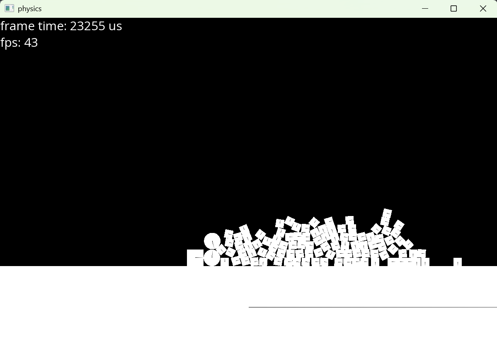

# Rigid Body Physics Engine
this is a 2d rigid body physics engine wrtten in c++ with sfml to draw stuff to the screen
the physics is pretty stable for small amounts of objects but can become jittery and slow for many objects
this is a pretty niave implementation with impulse based physics and no constraint solver so it is not particuarly fast and has stability issues
there is also no broad phase collision detection to speed up the program

I would do this project very differently if I were to do it again

there is a compiled exe for windows that you can run

# Controls
you can click and drag around the physics objects and thats it

# To Compile
currently only compiles for windows to compile to other platforms you will need to get the sfml binaries for that platform
on windows simply run
make all
definaly works with mingw have not tested if it compiles with msvc or clang
